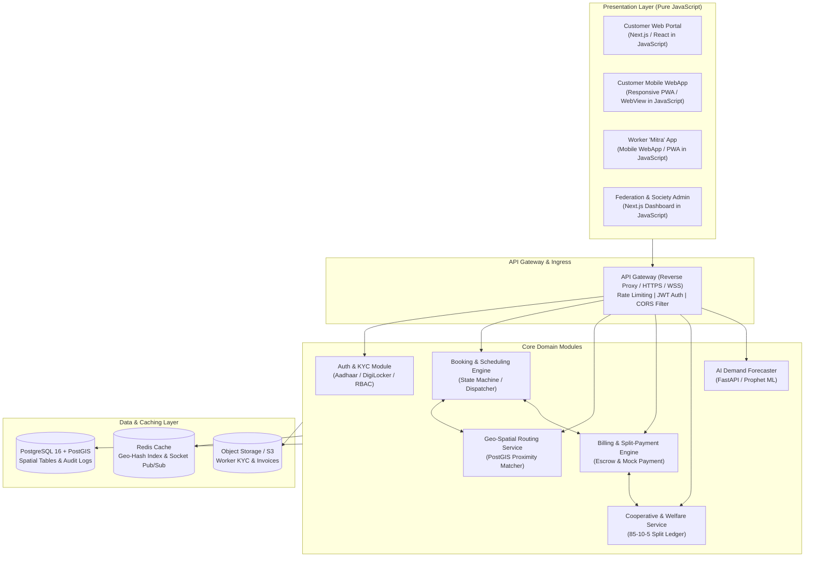
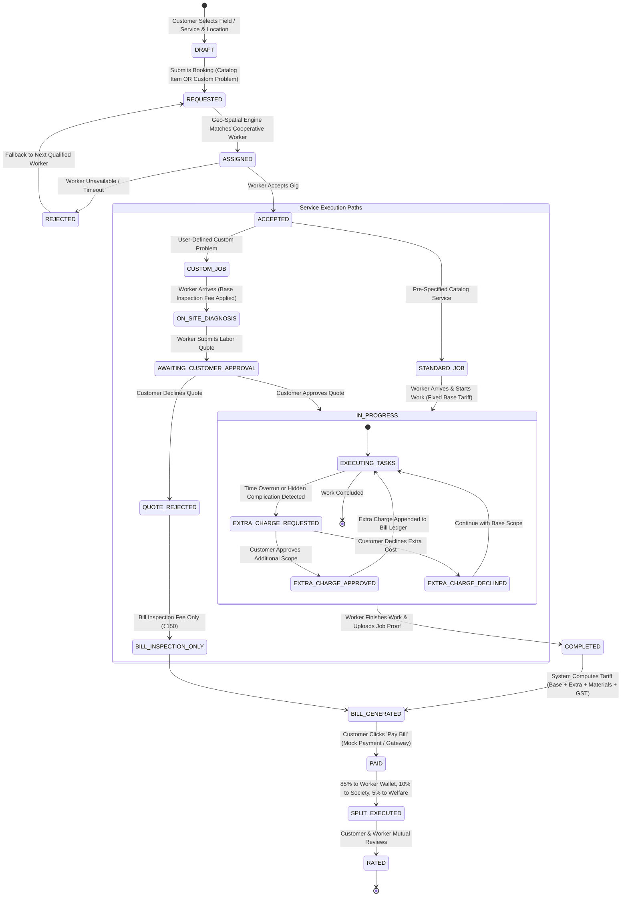

# System Architecture & Technical Design Document
## SahakarSeva: Cooperative Gig Services Platform
**Version:** 1.0.0 | **Problem Statement:** 26089 (Ministry of Cooperation / NCCT)

---

## 1. High-Level Architecture

The platform adopts a **Domain-Driven Modular Service Architecture** capable of running as a unified monolithic container in MVP stage and scaling into independently deployable microservices for multi-state production rollout.



---

## 2. Booking & Payment Lifecycle State Machine

The booking workflow tracks explicit state transitions, ensuring transactional consistency and accurate financial ledgering.



---

## 3. Geo-Spatial Proximity Engine (PostGIS)

### 3.1 Spatial Indexing
Each active worker's device streams periodic location updates (latitude, longitude) stored in PostgreSQL with a `GEOGRAPHY(Point, 4326)` column indexed via **R-Tree (GIST)**.

```sql
-- Spatial Index on Worker Location
CREATE INDEX idx_workers_current_location 
ON worker_profiles 
USING GIST (current_location);
```

### 3.2 Proximity Matching Query
When a household requests a service (e.g. Electrician) at coordinates `(user_lat, user_lng)`:

```sql
SELECT 
    w.id,
    w.full_name,
    w.phone,
    w.ncct_certification_level,
    s.society_name,
    w.rating_avg,
    ST_Distance(w.current_location, ST_MakePoint(:user_lng, :user_lat)::geography) AS distance_meters
FROM worker_profiles w
JOIN cooperative_societies s ON w.society_id = s.id
WHERE w.primary_trade = :service_category
  AND w.is_active = TRUE
  AND w.is_available = TRUE
  AND ST_DWithin(w.current_location, ST_MakePoint(:user_lng, :user_lat)::geography, :search_radius_meters)
ORDER BY 
  -- Balanced metric: Proximity + Rating + Fairness Weight
  (ST_Distance(w.current_location, ST_MakePoint(:user_lng, :user_lat)::geography) * 0.4) 
  - (w.rating_avg * 1000) 
  + (w.weekly_jobs_count * 500) ASC
LIMIT 5;
```

---

## 4. Financial Split Ledger Architecture (85-10-5)

Whenever a customer settles an invoice on the bill page:
1. **Total Invoice Amount (e.g., ₹600.00)**
2. **Worker Payout (85% = ₹510.00):** Immediately credited to worker's in-app wallet, accessible for instant UPI bank transfer.
3. **Cooperative Society Fund (10% = ₹60.00):** Credited to the local Primary Society ledger for administrative overhead, tool rental subsidies, and cooperative dividend reserves.
4. **Worker Welfare Pool (5% = ₹30.00):** Locked in the Federation Social Security Trust fund. When balance reaches ₹20 or ₹436, PMSBY or PMJJBY premiums are automatically funded on the worker's behalf.

---

## 5. Security & Data Protection
- **Aadhaar Vaulting:** No Aadhaar numbers are stored in plain text. Tokenized hashes from DigiLocker are preserved alongside verified badge timestamps.
- **Role-Based Access Control (RBAC):**
  - `CUSTOMER`: Can create bookings, view invoices, trigger payments, submit reviews.
  - `WORKER`: Can accept/reject bookings, mark progress, view personal wallet & welfare ledger.
  - `SOCIETY_ADMIN`: Can verify workers, oversee local disputes, monitor society revenue share.
  - `FEDERATION_ADMIN`: Access to multi-district heatmaps, policy configuration, and AI demand forecasts.
